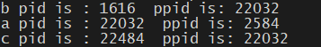

# 👨‍💻 Process Creation in C using fork()

This C program demonstrates **process creation** in Unix/Linux systems using the `fork()` system call. It shows how child and parent processes are created and how process IDs (PID) and parent process IDs (PPID) are related.

## 🧠 Description

The program creates **two child processes** using two calls to `fork()`.  
It prints the **PID** and **PPID** of each process created to help understand the process hierarchy.

### 🔁 How It Works:

1. The first `fork()` creates a child process (`b`).
2. Inside the parent process, a second `fork()` creates another child process (`c`).
3. Each process prints its own PID and its parent PID.

## 📋 Output (Sample)

Depending on execution timing and scheduling, sample output may look like:



> ⚠️ Note: Output order may vary with each execution due to process scheduling.

## 🛠️ Compilation

To compile the code, use:

```bash
gcc fork_example.c -o fork_example
```
▶️ Run the Program
```bash
./fork_example
```
🧪 Requirements
A Unix/Linux environment (e.g., Ubuntu)
GCC compiler

## ✍️ Author
**S.D.Tasuntha Chathunika** 
🎓 University of Vavuniya – Faculty of Information and Communication Technology  
📅 Date: 2025-06-09
🔗 [GitHub Profile](https://github.com/Tasuntha-Chathunika)

